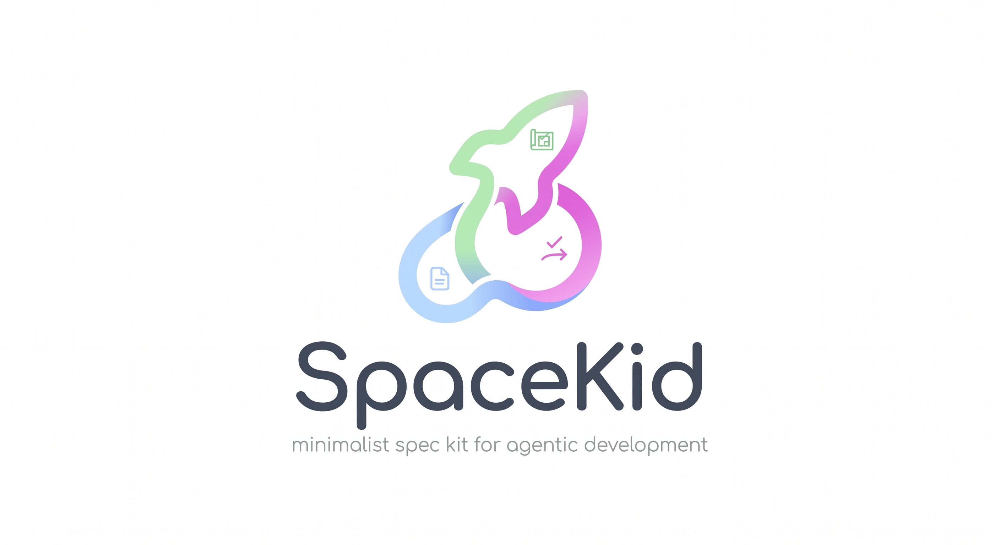
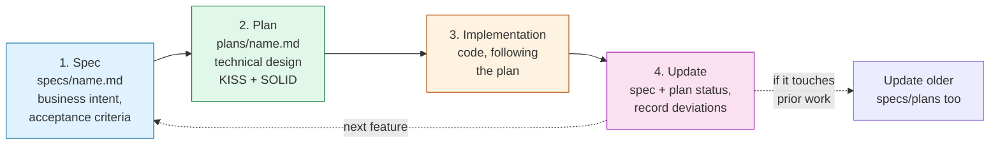

A minimalist spec kit for agentic development. The name is a play on
*"spec kit"* — a small, opinionated set of files that keeps AI agents (and
humans) working from a single, closed development loop instead of ad-hoc
prompting.

## Install

SpaceKid isn't published on PyPI yet, so install it straight from GitHub.
It's a command-line tool, not a library your code imports, so `pipx` is the
recommended way to get it — it installs `spacekid` in its own isolated
environment and puts the command on your `PATH`, without touching the
virtualenv of whatever project you run it in:

```bash
pipx install git+https://github.com/victorradael/spacekid.git
```

Alternatively, install it into a project's own virtualenv with `pip`:

```bash
pip install git+https://github.com/victorradael/spacekid.git
```

Or pin it as a dev dependency in that project's `pyproject.toml`:

```toml
[dependency-groups]
dev = ["spacekid @ git+https://github.com/victorradael/spacekid.git"]
```

If the repository is private, use the SSH form instead of `https://` on any
of the above (requires an SSH key registered with GitHub):

```
git+ssh://git@github.com/victorradael/spacekid.git
```

Then, from the root of the Python project you want to adopt the workflow in:

```bash
spacekid init
```

This scaffolds `AGENTS.md`, `specs/AGENTS.md`, and `plans/AGENTS.md` in the
current directory:

- `AGENTS.md` is created with the project's name filled in (detected from
  `pyproject.toml`, or the directory name otherwise — pass `--name` to set
  it explicitly). If the project already has an `AGENTS.md`, it's left
  untouched.
- `specs/AGENTS.md` and `plans/AGENTS.md` are created if missing; if either
  already exists, the standard SpaceKid content is appended to the end of
  it instead of overwriting it.

Run `spacekid init --path <dir>` to scaffold a different directory than the
current one.

### JavaScript / TypeScript projects

The same command is available as an npm package (source in [`js/`](js/)).
Run it on demand, or install it as a dev dependency:

```bash
npx @radaeltech/spacekid init
# or
npm install --save-dev @radaeltech/spacekid
```

It scaffolds the same three files with the same rules; the project name is
detected from `package.json` (or the directory name). Node 20 or newer is
required. The package ships its own TypeScript type definitions.

## Why a closed loop

Agentic coding tends to drift: an agent starts implementing before the
requirements are pinned down, technical decisions leak into what should be a
business document, and nothing records *why* the final implementation
differs from the original intent. Six months later, no file tells you what
was actually decided or why.

SpaceKid fixes this by making the workflow a **closed cycle across three
kinds of files**, each with exactly one job:

| File | Role | Contains |
|---|---|---|
| `specs/<name>.md` | **What & why** | Business context, requirements, acceptance criteria. No code. |
| `plans/<name>.md` | **How** | Technical design that satisfies the spec — KISS, SOLID, scalability, maintainability. |
| `AGENTS.md` | **Rules of the loop** | How agents navigate the repo and how the cycle must be followed. |

Each file only points in one direction: a plan may reference its spec, a
spec never references anything, and after implementation both loop back to
record their final status. This one-way referencing keeps specs readable in
isolation and prevents circular, tangled documentation.

## The cycle



1. **Spec** — Define *what* needs to be built and *why*, in pure business
   terms. No code, no architecture, no references to other files. See
   [`specs/AGENTS.md`](specs/AGENTS.md).
2. **Plan** — Once the spec is approved, design *how* to build it: the
   simplest approach that fully satisfies the spec, applying KISS and SOLID.
   This is the only file allowed to reference the spec. See
   [`plans/AGENTS.md`](plans/AGENTS.md).
3. **Implementation** — Code exactly what the plan describes. No spec, no
   plan, no implementation.
4. **Update (the step that's easy to forget)** — The moment implementation
   is done, the agent must go back and:
   - mark the plan `Done`, recording any deviation from the original design
     and why it was necessary;
   - mark the spec `Implemented`, updating acceptance criteria if reality
     forced a change;
   - update any *other* spec/plan pair whose behavior was affected along the
     way.

The loop only closes when step 4 happens. Skipping it is the single most
common way documentation rots — SpaceKid treats it as a non-negotiable part
of "done," not an optional cleanup step.

## Why this matters for agents specifically

Agents don't carry institutional memory between sessions the way a team
does. A closed, file-based loop means:

- **Simplicity by construction.** Splitting "what/why" from "how" stops
  business intent from getting buried under implementation detail — and
  keeps the plan honest about being the simplest design that works.
- **No silent drift.** Every implementation must reconcile itself against
  the spec and plan it came from, so the docs describe what was *actually*
  built, not just what was originally intended.
- **Any agent can resume cold.** Because each file is self-contained and the
  referencing direction is fixed, a new agent (or a new session) can read
  `AGENTS.md`, then the relevant spec and plan, and have full context without
  digging through chat history or commit logs.

## Repository layout

```
/AGENTS.md          # entry point: maps the repo, enforces the cycle
/specs/AGENTS.md     # how to write a good spec
/specs/<name>.md      # one per feature, business-only
/plans/AGENTS.md     # how to write a good implementation plan
/plans/<name>.md      # one per spec, technical design + status
/js/                 # npm package (spacekid init)
```

## Releasing the npm package

Releases are automatic. Every push to `main` runs the tests and then
[semantic-release](https://semantic-release.gitbook.io/), which looks only at
commits that touch `js/` and stages a release on npm when one deserves it. A
maintainer then promotes the staged version (see below):

- `fix:` → patch
- `feat:` → minor
- a `BREAKING CHANGE:` footer in the commit body → major (the `feat!:`
  shorthand is **not** recognized; the footer is required)

Anything else (Python-only changes, docs, tests, specs, plans) publishes
nothing. Tags are named `js-vX.Y.Z` and each one gets a GitHub Release with
generated notes. The pipeline runs `npm stage publish` using npm trusted
publishing (OIDC) with provenance: no npm token is stored in the repository.
The version only becomes public after a maintainer approves it:

```bash
npm stage list @radaeltech/spacekid
npm stage approve <stage-id>   # prompts for 2FA
# or: npm stage reject <stage-id>
```

Requires npm >= 11.15.0 and Node >= 22.14.

### One-time maintainer setup

1. Publish `0.1.0` once by hand (a trusted publisher can only be added to a
   package that already exists): check out the `js-v0.1.0` commit and run
   `npm login` (2FA) then `npm publish --access public --provenance=false`
   from `js/`. No token is needed. If the tag does not exist yet, create it: `git tag js-v0.1.0 <commit> && git push origin js-v0.1.0`.
2. On npmjs.com, open the package settings and add a **Trusted Publisher**:
   GitHub Actions, repository `victorradael/spacekid`, workflow `js.yml`.
   npm does not validate this on save; mistakes only show up at publish time.
3. In GitHub, protect `main` (require the `test` checks) and set the
   workflow's default token permissions to read-only.
   Also confirm the Trusted Publisher is allowed to stage versions.
4. After the first automated release succeeds, revoke the temporary npm token
   and confirm no `NPM_TOKEN` secret exists in the repository.

## Language

All documentation — specs, plans, `AGENTS.md` files, this README — is
written in English, regardless of the language used in conversation with the
agent.
